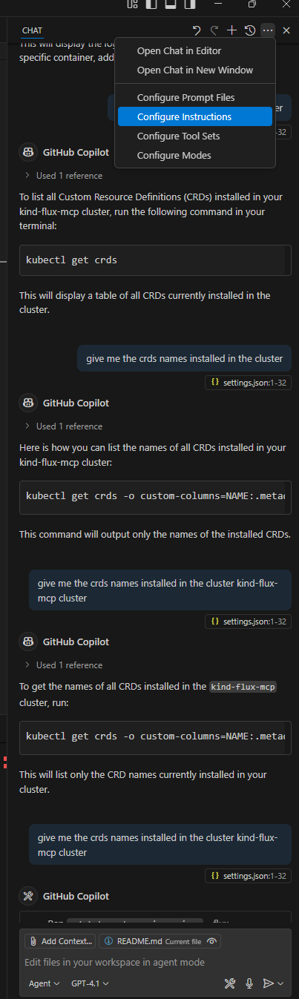
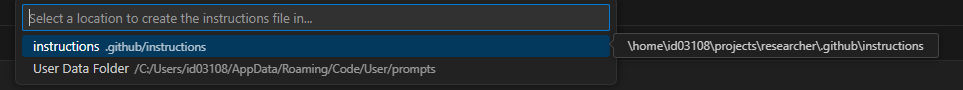
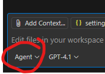

---

# Flux MCP Setup & Usage

This guide explains how to set up and use Flux MCP with GitOps, following [this tutorial](https://medium.com/@stefanprodan/ai-assisted-gitops-with-flux-mcp-server-cacb358c7c20) and the [Flux MCP documentation](https://fluxcd.control-plane.io/mcp/install/).

## Prerequisites

* [Go](https://go.dev) >= `1.22`
* [kind](https://kind.sigs.k8s.io/)
* Linux or WSL environment
* Optional: VSCode with GitHub Copilot integration

---

## 1️⃣ Create a Kind Cluster

```sh
kind create cluster -n flux-mcp
sudo kind get kubeconfig -n flux-mcp > flux-mcp.kubeconfig
```

---

## 2️⃣ Check Go Version

```sh
go version
```

If Go is **not installed**, install it:

```sh
wget https://go.dev/dl/go1.22.3.linux-amd64.tar.gz
sudo tar -C /usr/local -xzf go1.22.3.linux-amd64.tar.gz
```

Update your shell configuration (`~/.zshrc` or `~/.bashrc`):

```sh
export GOROOT=/usr/local/go/
export GOPATH=$HOME/go
export PATH=$PATH:$GOROOT/bin:$GOPATH/bin
```

Then reload your shell.

```sh
source ~/.zshrc   
# or
source ~/.bashrc   
```

---

## 3️⃣ Build MCP

Clone the repository and build the MCP binary:

```sh
git clone https://github.com/controlplaneio-fluxcd/flux-operator.git
cd flux-operator
```

Edit `go.mod` to match your installed Go version:

```sh
sed -i 's/^go [0-9]\+\.[0-9]\+\(\.[0-9]\+\)\?$/go 1.22/' go.mod
```

Build MCP:

```sh
make mcp-build
```

The binary will be available at: `./bin/flux-operator-mcp`

---

## 4️⃣ Use Predefined Instructions

The Flux MCP server comes with a set of predefined instructions you can use.
See [instructions.md](https://raw.githubusercontent.com/controlplaneio-fluxcd/distribution/refs/heads/main/docs/mcp/instructions.md) for more details.

### Example Screenshots




---

## 5️⃣ WSL & VSCode Copilot Integration (Optional)

If you're using **Windows Subsystem for Linux** and Copilot integrated with **Visual Studio Code**, edit Copilot's `settings.json` to enable the *Agent* option:



---

## 6️⃣ Example Prompts

You can test MCP by giving it prompts like:

* `give me the logs to this pod: kube-apiserver-flux-mcp-control-plane`
* `then give me the names of the all pods in the cluster`
* `give me the namespaces in the kind-flux-mcp cluster`
* `give me all pods running in the cluster in table format`
* `Which cluster contexts are available in my kubeconfig?`

---

📖 **References:**

* [AI-assisted GitOps with Flux MCP](https://medium.com/@stefanprodan/ai-assisted-gitops-with-flux-mcp-server-cacb358c7c20)
* [Flux MCP Install Docs](https://fluxcd.control-plane.io/mcp/install/)

---
