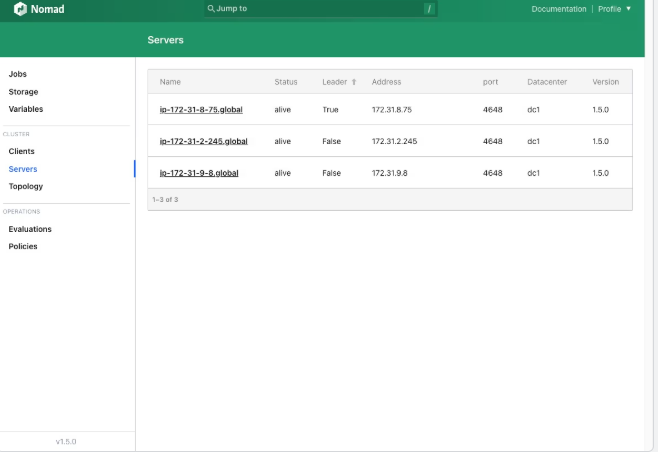

# Nomad Getting Started Guide

This guide walks you through installing HashiCorp Nomad, setting up a development cluster, and deploying a sample application stack.  

Reference: [Nomad Getting Started Tutorial](https://developer.hashicorp.com/nomad/tutorials/get-started/gs-start-a-cluster)

---

## 📦 Install Nomad

Add HashiCorp's apt repository and install Nomad:

```sh
wget -O - https://apt.releases.hashicorp.com/gpg | sudo gpg --dearmor -o /usr/share/keyrings/hashicorp-archive-keyring.gpg

echo "deb [arch=$(dpkg --print-architecture) signed-by=/usr/share/keyrings/hashicorp-archive-keyring.gpg] https://apt.releases.hashicorp.com $(grep -oP '(?<=UBUNTU_CODENAME=).*' /etc/os-release || lsb_release -cs) main" | sudo tee /etc/apt/sources.list.d/hashicorp.list

sudo apt update && sudo apt install nomad
```

---

## 📝 Clone the Sample Repository

```sh
git clone https://github.com/hashicorp-education/learn-nomad-getting-started
cd learn-nomad-getting-started
git checkout -b nomad-getting-started v1.1

```

---

## 🚀 Start a Nomad Development Agent

Run Nomad in development mode (single node cluster):

```sh
sudo nomad agent -dev \
  -bind 0.0.0.0 \
  -network-interface='{{ GetDefaultInterfaces | attr "name" }}'
```

> 🌟 *Leave this terminal open.*

---

## 🔍 Connect to Nomad

In a **second terminal**, set the `NOMAD_ADDR` environment variable:

```sh
export NOMAD_ADDR=http://localhost:4646
```

Verify nodes:

```sh
nomad node status
```

You can also open the Nomad UI in your browser:
👉 [http://localhost:4646/ui](http://localhost:4646/ui)



---

## 📂 Deploy Jobs

Change to the `jobs/` directory:

```sh
cd jobs/
```

Run the Redis and web application jobs:

```sh
nomad job run pytechco-redis.nomad.hcl
nomad job run pytechco-web.nomad.hcl
```

---

## 🌐 Access the Web App

Get the service IP address of `pytechco-web`:

```sh
nomad node status -verbose \
  $(nomad job allocs pytechco-web | grep -i running | awk '{print $2}') | \
  grep -i ip-address | awk -F "=" '{print $2}' | xargs | \
  awk '{print "http://"$1":5000"}'
```

Open the printed URL in your browser, e.g.:

> [http://172.20.155.220:5000](http://172.20.155.220:5000)

---

## 👷 Dispatch Setup Job

Run and dispatch the setup job:

```sh
nomad job run pytechco-setup.nomad.hcl
nomad job dispatch -meta budget="200" pytechco-setup
```

Then deploy the employee service:

```sh
nomad job run pytechco-employee.nomad.hcl
```

You can now visit the web app again to see updated data.

---

## 🔄 Upgrade Employee Service

Stop the existing employee job, adjust budget, and deploy an upgrade:

```sh
nomad job stop -purge pytechco-employee

nomad job dispatch -meta budget="500" pytechco-setup

nomad job run pytechco-employee.nomad-upgrade.hcl
```

---

## 🧹 Cleanup

Stop all running jobs:

```sh
nomad job stop -purge pytechco-employee
nomad job stop -purge pytechco-web
nomad job stop -purge pytechco-redis
nomad job stop -purge pytechco-setup
```

---

## 📖 Resources

* [Nomad Documentation](https://developer.hashicorp.com/nomad/docs)
* [Nomad Tutorials](https://developer.hashicorp.com/nomad/tutorials)
